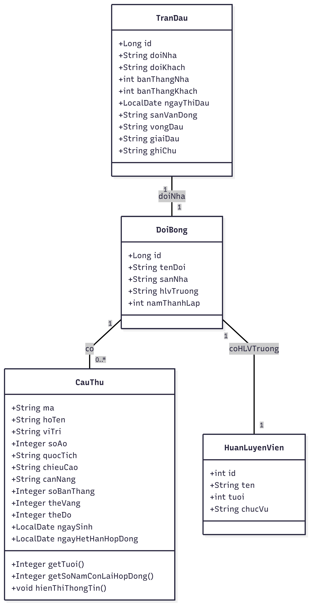

# Ứng dụng quản lý đội bóng
Bài tập lớn môn **Lập trình hướng đối tượng** sử dụng Java + Spring Boot + Mô hình MVC
--- 

## Giới thiệu dự án :
Quản lý cầu thủ và câu lạc bộ là một bài toán phổ biến trong thực tế thể thao. Dự án này mô phỏng một hệ thống đơn giản giúp thao tác, lưu trữ và tổ chức thông tin đội bóng, hỗ trợ học tập và phát triển phần mềm thực tế.

## Group 09 - N03: 

Thành viên nhóm bao gồm:

Nguyễn Thị Nhung - 23010607

Bùi Quang Huy - 23010317

## Các đối tượng :

* Cầu thủ : Mã cầu thủ, họ tên, tuổi, vị trí, quốc tịch...
* Trận đấu : Đội nhà/Khách,số bàn thắng,ngày thi đấu,sân vận động...
* Huấn luyện viên : ID,họ tên, tuổi ,chức vụ...

## Chức năng chính 

* Thêm mới cầu thủ,sửa cầu thủ,xoá,tìm kiếm Cầu thủ theo các tiêu chí.Hiển thị danh sách cầu thủ.
* Thêm,sửa,xoá Trận đấu.
* Thêm sửa xoá Huấn luyện viên
* Thống kê các tiêu chí như : số cầu thủ,tuổi trung bình,số bàn thắng,số thẻ đỏ, số thẻ vàng,tỷ lệ thắng,cầu thủ ghi bàn nhiều nhất, cầu thủ lơn tuổi nhất .....
* Thống kê dạng biểu đồ cho các tiêu chí : số cầu thủ theo vị trí,quốc tịch,tỷ lệ thắng/hoà/thua sau các trận. 

## UML Dự Án 
1.1 UML Class diagram :

1.2 UML Sequence diagram:
* Thêm đối tượng :

* Sửa đối tượng :

* Xoá đối tượng :

* Tìm kiếm đối tượng :

## Giao diện

### Giao diện Trang chủ :

### Giao diện giới thiệu :

### Giao diện quản lý cầu thủ :

### Giao diện quản lý huấn luyện viên :

### Giao diện quản lý trận đấu :

### Giao diện thống kê :

Lưu đồ bài toán

## DEMO SẢN PHẨM :

## Cách cài đặt :
